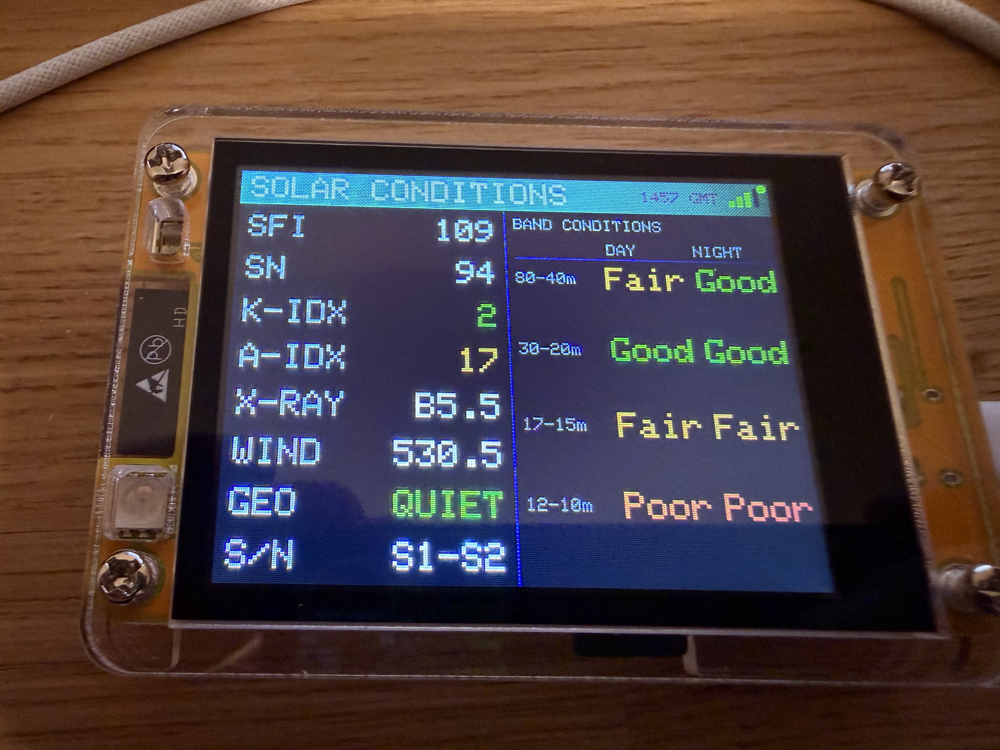
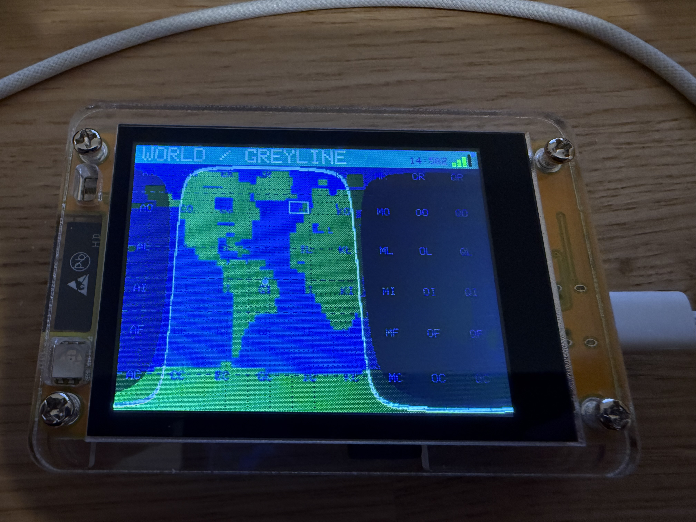
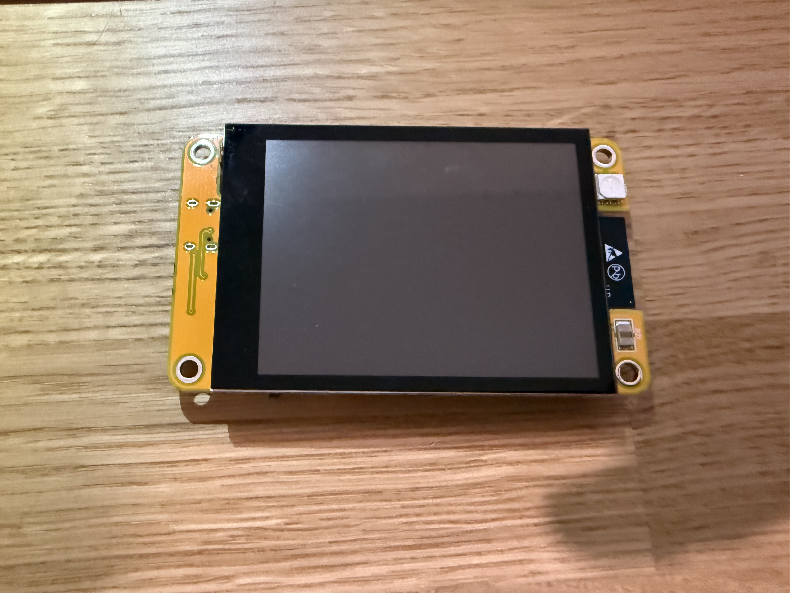
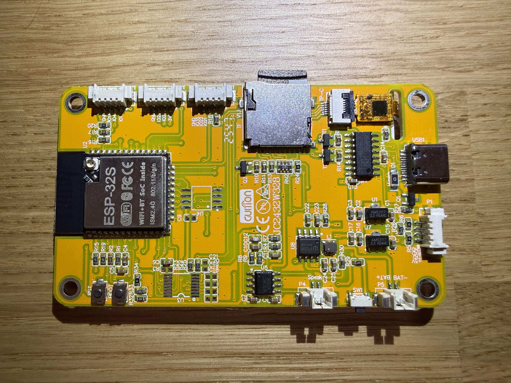

# CheapClock

An amateur radio information display built for the **Guition JC2432W328** ESP32 development board with 2.4" touchscreen.

CheapClock turns a cheap (~£15) ESP32 touch display into a live ham radio dashboard — pulling real-time propagation data, DX spots, contest schedules, and more from the internet. It's designed as a starting point for radio amateurs to customise and extend into something that suits their shack.

<p align="center">
  
  
</p>
<p align="center">
  
  
</p>

## Hardware

**Board:** Guition JC2432W328 (or equivalent)
- ESP32 @ 240 MHz, 4 MB flash
- 2.4" 320x240 ST7789 TFT LCD (SPI)
- CST820 capacitive touchscreen (I2C)
- SD card slot
- LDR (light sensor) for auto-brightness
- RGB LED

No additional hardware required — everything runs on the stock board.

## Features

### 10 Display Screens

| Screen | What it shows |
|--------|--------------|
| **Solar Conditions** | SFI, sunspot number, K/A indices, X-ray, solar wind, geomagnetic field status, band conditions (80m–10m day/night) from [hamqsl.com](https://www.hamqsl.com/solar.html) |
| **DX Cluster** | 10 live DX spots with frequency and callsign. Tap a spot to see bearing and distance from your grid square |
| **Greyline Map** | Real-time world map with day/night terminator, twilight zones, and geographic grid lines |
| **Contest Calendar** | Active and upcoming contests parsed from [contestcalendar.com](https://www.contestcalendar.com/) RSS feed |
| **Clock** | UTC and local time, date, callsign, grid square, sunrise/sunset, moon phase, and weather (with OpenWeatherMap API key) |
| **POTA Spots** | 10 live Parks on the Air activations with park reference, callsign, frequency, and mode |
| **SOTA Spots** | 10 live Summits on the Air activations with summit reference, callsign, frequency, and mode |
| **WSPR Activity** | Live reception counts across 11 WSPR bands (160m–6m) from [wspr.live](https://wspr.live/) |
| **HF Propagation** | VOACAP-style band-by-region propagation predictions (80m–10m to NA, SA, EU, AF, AS, OC) calculated locally using current SSN and your grid square |
| **PSKReporter** | World map showing who is receiving your signal in the last 15 minutes via [PSKReporter](https://pskreporter.info/), colour-coded by band. Requires callsign to be set |

### Display Features

- **Auto-cycle** through all screens at a configurable interval (5–120 seconds)
- **Colour-coded** status indicators throughout the interface
- **Auto-brightness** using the onboard LDR, or set brightness manually
- **Screen timeout** to save power (0–30 minutes, 0 = always on)
- **Refresh indicator** — coloured dot shows data fetch status (amber = fetching, green = fresh, red = stale)
- **WiFi signal strength** indicator

### Touch Interface

- Swipe or tap to change screens
- Full on-screen QWERTY keyboard for entering callsign, grid square, and WiFi credentials
- 7-page settings menu for all configuration

### Settings (via touchscreen)

1. **WiFi** — scan and connect to networks
2. **Callsign & Grid Square** — displayed on clock screen and used for bearing/sunrise calculations
3. **Brightness** — manual slider or auto-brightness toggle
4. **Auto-cycle** — enable/disable and set cycle speed
5. **Screen timeout** — set sleep timer
6. **UTC offset** — local time display (-12 to +14)
7. **Screen toggles** — enable or disable individual screens from the cycle

### Built-in Calculations

- **Sunrise/sunset** from your Maidenhead grid square
- **Moon phase** name and age
- **DX bearing and distance** (great circle) from your grid to spotted stations
- **DXCC prefix lookup** for ~46 entities
- **Solar geometry** for the greyline map (declination, subsolar point, terminator)
- **HF propagation prediction** — simplified ITU-R model using SSN, time of day, season, latitude, and path distance to estimate MUF and band reliability

### Other

- **SD card config** — settings persist across reboots via `/config.txt`
- **OTA firmware updates** — check for and install new versions over WiFi. The OTA URLs in the code currently point to the author's server. If you fork this project, update `OTA_VERSION_URL` and `OTA_FIRMWARE_URL` in `CheapClock.ino` to point to your own server
- **OpenWeatherMap integration** — optional, add your API key for weather on the clock screen

## Configuration

Settings can be changed via the touchscreen menu or by editing `config.txt` on the SD card:

```
callsign=M0ABC
grid=IO91wm
brightness=200
ssid=MyWiFi
password=MyPassword
autocycle=1
autobrightness=1
tzoffset=0
cyclespeed=15
screentimeout=10
screens=1111111111
owmkey=your_openweathermap_api_key
```

## Building

### 1. Install Arduino IDE

Download and install the [Arduino IDE](https://www.arduino.cc/en/software) (v2.x recommended).

### 2. Add ESP32 board support

1. Open **File > Preferences**
2. In **Additional Board Manager URLs**, add:
   ```
   https://espressif.github.io/arduino-esp32/package_esp32_index.json
   ```
3. Open **Tools > Board > Boards Manager**
4. Search for **esp32** and install **esp32 by Espressif Systems**

### 3. Install libraries

Open **Tools > Manage Libraries** and install:

| Library | Author | Purpose |
|---------|--------|---------|
| **LovyanGFX** | lovyan03 | TFT display driver (ST7789) |
| **bb_captouch** | bitbank2 | Capacitive touch driver (CST820) |

All other libraries (`WiFi`, `HTTPClient`, `SD`, `SPI`, etc.) are included with the ESP32 board package.

### 4. Configure and upload

1. Open `CheapClock.ino`
2. Connect the board via USB-C
3. Under **Tools**, set:
   - **Board:** ESP32 Dev Module
   - **CPU Frequency:** 240 MHz
   - **Partition Scheme:** Default 4MB with spiffs
   - **Flash Size:** 4MB
   - **Upload Speed:** 921600
   - **Port:** *(select the COM port that appears when you plug in the board)*
4. Click **Upload**

### 5. SD card setup (optional)

Format a micro SD card as FAT32 and create a `config.txt` file to store your settings (see [Configuration](#configuration) above). Without an SD card, settings will revert to defaults on each reboot.

## Acknowledgements

- [bb_captouch](https://github.com/bitbank2/bb_captouch) by [@bitbank2](https://github.com/bitbank2) — CST820 capacitive touch driver
- [maxpill/JC2432W328](https://github.com/maxpill/JC2432W328) — board documentation, pinouts, and example code for the Guition JC2432W328
- [ESP32-Cheap-Yellow-Display](https://github.com/witnessmenow/ESP32-Cheap-Yellow-Display) by [@witnessmenow](https://github.com/witnessmenow) — community resource for CYD variants and projects

## Data Sources

| Data | Source | Refresh |
|------|--------|---------|
| Solar/propagation | [hamqsl.com/solarxml.php](https://www.hamqsl.com/solarxml.php) | 60s |
| DX spots | [dxlite.g7vjr.org](http://dxlite.g7vjr.org/) | 60s |
| Contests | [contestcalendar.com RSS](https://www.contestcalendar.com/calendar.rss) | 1 hour |
| POTA spots | [api.pota.app](https://api.pota.app/spot/activator) | 60s |
| SOTA spots | [api2.sota.org.uk](https://api2.sota.org.uk/api/spots/30) | 60s |
| WSPR activity | [wspr.live](https://db1.wspr.live/) | 5 min |
| HF propagation | Calculated locally (ITU-R model + SSN) | 5 min |
| PSKReporter | [pskreporter.info](https://retrieve.pskreporter.info/) | 5 min |
| Weather | [OpenWeatherMap](https://openweathermap.org/api) | via clock refresh |
| Time | NTP (pool.ntp.org) | on boot |

## Contributing

This project is meant as a starting point. Fork it, hack on it, add the screens you want. Some ideas:

- Band activity heatmap
- QRZ lookup on DX spots
- Local repeater list
- Logbook integration
- CW/FT8 decode display
- APRS tracker

## License

This project is licensed under the [GNU General Public License v3.0](LICENSE).
